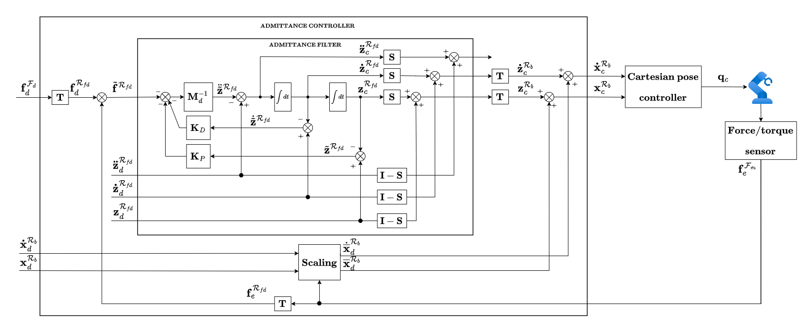

# acg_admittance_controller

This package contains the implementation of an admittance controller, namely `AdmittanceController` class, which extends the [`motion_based_interaction_controller::MotionBasedInteractionController`](../motion_based_interaction_controller/include/motion_based_interaction_controller/motion_based_interaction_controller.hpp) base class.

The admittance controller scheme is shown in the following figure:

where the block _T_ represents a generic transformation converting quantities from a frame to another.
The desired force is set to zero to make the robot behave compliantly with the environment, and the motion reference for the admittance filter is set to zero to reach a complete stop of the robot upon reaching the target pose,effectively preventing any collisions caused by further movement.
The controller embeds the force limitation strategy proposed in the [paper](https://arxiv.org/abs/2503.21288).

For more information on the controller interfaces and the reference frames, please refer to the [`motion_based_interaction_controller`](../motion_based_interaction_controller/README.md) package.
For more information on the admittance filter, please refer to the [`admittance_filter`](../interaction_filters/admittance_filter/README.md) package.

## Controller Configuration

The controller configuration is carried out by the base class and the parameters are defined in the [`motion_based_interaction_controller_parameters.yaml`](../motion_based_interaction_controller/src/motion_based_interaction_controller_parameters.yaml) and [`admittance_filter_parameters.yaml`](../interaction_filters/admittance_filter/src/admittance_filter_parameters.yaml) configuration files.
The admittance controller specific parameters are related to the force limitation strategy and are defined in the [`acg_admittance_controller_parameters.yaml`](./src/acg_admittance_controller_parameters.yaml) configuration file.
Please refer to [`acg_admittance_controller_parameters.md`](./doc/acg_admittance_controller_parameters.md) for the documentation.

## Demo

A demo of the admittance controller with the UR10 is available in the [`acg_resources_ur10_movit_config`](../acg_resources_ur10_moveit_config/README.md#simulation-with-admittance-controller) package.
