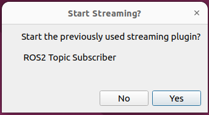
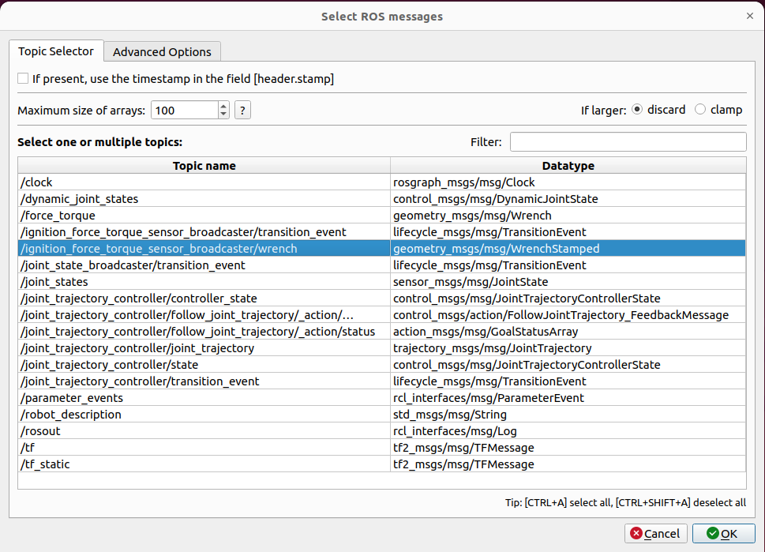

# acg_resources_ur5e_moveit_config

This package is an extension of the official UR's `ur_moveit_config` package, enhancing its integration with Ignition Gazebo.
It provides various simulation setups for the UR5e robot, including options for simulation with or without RViz's **MotionPlanning** plugin, as well as the integration of a force/torque sensor and effort interfaces.

Before continuing, make sure to use `rosdep` to install missing dependencies.

## Simulation without Motion Planning plugin

In order to start the simulation in Gazebo:

```bash
ros2 launch acg_resources_ur5e_moveit_config gazebo_ros2_control_demo.launch.py
```

Additionally, it is possible to run a dynamic simulation in Gazebo by setting the `enable_effort_interfaces` parameter, i.e.:

```bash
ros2 launch acg_resources_ur5e_moveit_config gazebo_ros2_control_demo.launch.py enable_effort_interfaces:=true
```

In order to move the robot using the `ur_robot_driver` package, sending positional commands via topic to the joint trajectory controller, in another terminal, run:

```bash
ros2 launch ur_robot_driver test_joint_trajectory_controller.launch.py
```

For safety reason, the trajectory is designed not to move the second joint from the "arm up" configuration.

Please be aware that in order to execute the previous command, you have to install the `ur_robot_driver` package, which can be done running:

```bash
sudo apt install ros-humble-ur-robot-driver
```

It is possible to spawn the robot to a custm height in Gazebo by setting the `spawn_z` parameter, e.g.:

```bash
ros2 launch acg_resources_ur5e_moveit_config gazebo_ros2_control_demo.launch.py spawn_z:=0.5
```

### Gazebo world configuration

It is possible to start the simulation with a different Gazebo world by specifying the `gazebo_world_package` and `gazebo_world_file_path` parameters in the launch file.
For example, to start the simulation with the world provided by the `acg_resources_ft_sensor_gazebo_description` package, run:

```bash
ros2 launch acg_resources_ur5e_moveit_config gazebo_ros2_control_demo.launch.py gazebo_world_package:=acg_resources_ft_sensor_gazebo_description gazebo_world_file_path:=world/world_with_ft_sensor.sdf
```

### End-effector configuration

It is possible to start the simulation in Gazebo with various end-effectors attached to the UR5e robot by specifying the desired one through the `ee_config_file` parameter in the launch file.
Some end-effector configurations are made available in the [`config`](config/) directory of this package. These include:

* [`ft_sensor_and_long_handle_ee_config.yaml`](config/ft_sensor_and_long_handle_ee_config.yaml): end-effector consisting of a force/torque sensor and a long handle as a tool;
* [`ft_sensor_and_short_handle_ee_config.yaml`](config/ft_sensor_and_short_handle_ee_config.yaml): end-effector consisting of a force/torque sensor and a short handle as a tool;
* [`robotiq_fts150_and_chalk_holder_ee_config.yaml`](config/robotiq_fts150_and_chalk_holder_ee_config.yaml): end-effector consisting of a Robotiq FTS150 force/torque sensor and a chalk holder as a tool.

For example, to start the simulation with the `ft_sensor_and_long_handle_ee_config.yaml` end-effector configuration, run:

```bash
ros2 launch acg_resources_ur5e_moveit_config gazebo_ros2_control_demo.launch.py ee_config_file:=ft_sensor_and_long_handle_ee_config.yaml
```

The end-effector configuration file can also be loaded from a different package by specifying the `ee_config_package` parameter, e.g.:

```bash
ros2 launch acg_resources_ur5e_moveit_config gazebo_ros2_control_demo.launch.py ee_config_file:=ft_sensor_and_long_handle_ee_config.yaml ee_config_package:=acg_resources_ur5e_moveit_config
```

Notice that the configuration file must be located in the `config/` directory of the package specified in the `ee_config_package` parameter.

For instructions on how to write end-effector configuration files, please refer to the [dedicated section in the `end_effector_builder` package README](../end_effectors/end_effector_builder/README.md#how-to-write-end-effector-configuration-files).

Note that within this package, the end-effector configuration files are extended with the following parameters:

* `ignored_collision_links`: a list of links which collisions with the end-effector should be ignored when planning trajectories in MoveIt!;

For an example of how to use this parameter, please check the [`ft_sensor_and_long_handle_ee_config.yaml`](config/ft_sensor_and_long_handle_ee_config.yaml) file.
By default, the `wrist_1_link`, `wrist_2_link`, and `wrist_3_link` links are ignored, as they will not collide with most of the end-effectors.

## Simulation with Motion Planning plugin

In order to start the simulation with Gazebo and MoveIt! planning system, run:

```bash
ros2 launch acg_resources_ur5e_moveit_config moveit_gazebo_ros2_control_demo.launch.py
```

Additionally, it is possible to run a dynamic simulation with Gazebo and MoveIt! planning system by setting the `enable_effort_interfaces` parameter, i.e.:

```bash
ros2 launch acg_resources_ur5e_moveit_config moveit_gazebo_ros2_control_demo.launch.py enable_effort_interfaces:=true
```

Here, the user can plan trajectories through the MoveIt! planning pipeline by using the `MotionPlanning` plugin in RViz.
Execution is performed on the Gazebo robot through the `moveit_simple_controller_manager`, which uses the loaded joint trajectory controller.

When launching the `moveit_gazebo_ros2_control_demo.launch.py` demo with the `ee_config_file` parameter set to one of the available end-effector configurations, the MoveIt! planning system will be automatically configured to plan trajectories for the robot with the specified end-effector attached.

For example, to start the simulation with the `ft_sensor_and_long_handle_ee_config.yaml` end-effector configuration, run:

```bash
ros2 launch acg_resources_ur5e_moveit_config moveit_gazebo_ros2_control_demo.launch.py ee_config_file:=ft_sensor_and_long_handle_ee_config.yaml
```

## Simulation with force/torque sensing

This package also provides several simulated demos with the UR5e robot and a force/torque sensor in Ignition.
To launch the demo it is required to set the `ee_config_file` parameter to a end-effector description containing a F/T sensor and set the `enable_ft_sensing` parameter to `true`, e.g.:

```bash
ros2 launch acg_resources_ur5e_moveit_config gazebo_ros2_control_demo.launch.py ee_config_file:=ft_sensor_and_long_handle_ee_config.yaml enable_ft_sensing:=true
```

Setting the `enable_ft_sensing` parameter to `true` activates the Ignition Gazebo force/torque sensor plugin, which publishes the forces and torques measured by the sensor on the `/force_torque` topic.

To check that the simulated F/T sensor is working correctly, run:

```bash
ros2 topic echo /force_torque
```

### F/T sensor related parameters

The main parameters contained in the launch file, relating to the simulation with F/T sensor, are:

* `enable_ft_sensing`: if `true`, launches an Ignition simulation with the UR5e and a force/torque sensor; by default this value is set to `false`;
* `ft_plot`: if both the `enable_ft_sensing` parameter and this parameter are set to `true`, the PlotJuggler tool is launched to display the F/T measurements.
    By default, this parameter is set to `false`.

### F/T sensor bias compensation

When the `enable_ft_sensing` parameter is set to `true`, the [`gazebo_force_torque_sensor` ros2_control plugin](../gazebo_force_torque_sensor/) is loaded by default.
This plugin can compensate for sensor bias as long as the manipulator maintains a fixed orientation and writes the filtered measurements on the `ros2_control` state interfaces.
The launch file will also start a `force_torque_sensor_broadcaster`, which reads content of the state interfaces and writes them on the `/force_torque_sensor_broadcaster/wrench` topic.
To check that the system is working correctly, run:

```bash
ros2 topic echo /force_torque_sensor_broadcaster/wrench
```

Note that the `/force_torque` topic containing the raw measurements is always available, regardless of wether the bias compensation is enabled or not.
For more details, refer to the [`gazebo_force_torque_sensor` package README](../gazebo_force_torque_sensor/README.md#L0010).

The configuration parameters for the `ros2_control` plugin are set in the end-effector configuration file, under the `force_torque_sensor.ros2_control_params` key.
The `gazebo_force_torque_sensor` plugin in particular accepts the following parameter:

* `number_of_samples_for_computing_bias`: The number of measurements to consider for estimating the bias along the sensor axes.
  When set to `0`, the bias is not estimated and the raw measurements are published.
  The default value is `10`.
* `stable_readings_tolerance`: The tolerance for considering the readings stable.
  If the difference between the current reading and the previous reading is less than this value, the reading is considered stable.
  The default value is `1e-6`.

For more information on the configuration parameters of other `ros2_control` plugins, please refer to the corresponding package documentation.

### Plotting F/T measurements

If you want to plot the F/T measurements, simply set the `ft_plot` flag to `true`, as in the following command:

```bash
ros2 launch acg_resources_ur5e_moveit_config gazebo_ros2_control_demo.launch.py ee_config_file:=ft_sensor_and_long_handle_ee_config.yaml enable_ft_sensing:=true ft_plot:=true
```

When launching the `GazeboFTSensor` plugin demo with the `ft_plot` flag set to `true`, **PlotJuggler** is also launched as a ROS2 node to visualize the measured wrenches. In this scenario, the following dialog window will appear:



In order to visualize the wrenches that the plugin writes on its state interfaces press the **YES** button.
After that, the following dialogue window will be shown:



Once you have ensured that the topic highlighted in the image above is present, press the **YES** button.

Following these steps, force/torque graphs will be shown.

### F/T sensing with dynamic simulations and Motion Planning plugin

Force/torque sensing also works with dynamic simulations. Therefore, to explore this use case, run

```bash
ros2 launch acg_resources_ur5e_moveit_config gazebo_ros2_control_demo.launch.py ee_config_file:=ft_sensor_and_long_handle_ee_config.yaml enable_ft_sensing:=true enable_effort_interfaces:=true
```

If you also want to enable the planning system, the `moveit_gazebo_ros2_control_demo.launch.py` launch file can be used, e.g.:

```bash
ros2 launch acg_resources_ur5e_moveit_config moveit_gazebo_ros2_control_demo.launch.py ee_config_file:=ft_sensor_and_long_handle_ee_config.yaml enable_ft_sensing:=true
```

The dynamic simulation and the planning system can also work together.
This can be useful to simulate applications where the robot interacts with the environment and the force/torque sensor is used to control the robot's behavior.
To perform this kind of simulation, both the `enable_ft_sensing` and `enable_effort_interfaces` parameters must be set to `true`, e.g.:

```bash
ros2 launch acg_resources_ur5e_moveit_config moveit_gazebo_ros2_control_demo.launch.py ee_config_file:=ft_sensor_and_long_handle_ee_config.yaml enable_ft_sensing:=true enable_effort_interfaces:=true
```

The `ft_plot` parameter can also be used jointly with the planning system, e.g.

```bash
ros2 launch acg_resources_ur5e_moveit_config moveit_gazebo_ros2_control_demo.launch.py ee_config_file:=ft_sensor_and_long_handle_ee_config.yaml enable_ft_sensing:=true ft_plot:=true
```

## Trajectory execution with mock hardware

The `ur5e_moveit.launch.py` demo provides a basic execution demo using mock hardware, loading a `ros2_control_node` (identified by `ros2 node list` as `/controller_manager`) and spawning a joint trajectory controller.
In this case, a `moveit_simple_controller_manager` is also instantiated, which, despite its name, provides action clients connecting to the controllers loaded by the (real) controller manager.
For more information, please refer to [this tutorial](https://moveit.picknik.ai/humble/doc/examples/controller_configuration/controller_configuration_tutorial.html).

First, the mock robot drivers need to be started using the `ur_robot_driver` package.
Without this configuration, the trajectory executions will consistently fail.
So, run:

```bash
ros2 launch ur_robot_driver ur_control.launch.py ur_type:=ur5e robot_ip:=xxx.yyy.zzz use_fake_hardware:=true launch_rviz:=false initial_joint_controller:=joint_trajectory_controller
```

In order to start RViz with the Motion Planning plugin, run:

```bash
ros2 launch acg_resources_ur5e_moveit_config ur5e_moveit.launch.py
```

## Simulation with other controllers

### Simulation with forward position controller and external reference generator

To launch the demo by activating the forward position controller, run

```bash
ros2 launch acg_resources_ur5e_moveit_config gazebo_ros2_control_demo.launch.py initial_joint_controller:=forward_position_controller
```

If the `initial_joint_controller` parameter is not specified, the demo launches the joint trajectory controller by default.

Position references can be sent to the Gazebo robot by an external reference generator, such as `ros2 topic pub`, e.g.

```bash
ros2 topic pub /forward_position_controller/commands std_msgs/msg/Float64MultiArray "data: [1.4, -1.6, 1.5, -1.2, -1.6, 0.0]"
```

### Simulation with forward velocity controller and external reference generator

To launch the demo by activating the forward velocity controller, run

```bash
ros2 launch acg_resources_ur5e_moveit_config gazebo_ros2_control_demo.launch.py initial_joint_controller:=forward_velocity_controller
```

If the `initial_joint_controller` parameter is not specified, the demo launches the joint trajectory controller by default.

Velocity references can be sent to the Gazebo robot by an external reference generator, such as `ros2 topic pub`, e.g.

```bash
ros2 topic pub /forward_velocity_controller/commands std_msgs/msg/Float64MultiArray "data: [0.3, 0.0, 0.0, 0.0, 0.7, 0.5]"
```

### Simulation with PID effort-based position controller and external reference generator

To launch the demo by activating the PID effort-based position controller, run:

```bash
ros2 launch acg_resources_ur5e_moveit_config gazebo_ros2_control_demo.launch.py enable_effort_interfaces:=true initial_joint_controller:=pid_effort_controller
```

Please, be aware that when executing the above command, the robot will initially fall under the effect of the gravity.

If the `initial_joint_controller` parameter is not specified, the demo launches the joint trajectory controller by default.

Position references can be sent to the Gazebo robot by an external reference generator, such as `ros2 topic pub`, e.g.

```bash
ros2 topic pub /pid_effort_controller/reference control_msgs/msg/MultiDOFCommand "{dof_names: ['shoulder_pan_joint', 'shoulder_lift_joint', 'elbow_joint', 'wrist_1_joint', 'wrist_2_joint', 'wrist_3_joint'], values: [0.2, -1.57, 0.0, -1.57, 0.0, 0.0]}"
```

## Simulation with reference generators

To simulate the joint space and task space reference generators, properly configure the [`ur5e_test_reference_controllers.yaml`](./config/ur5e_test_reference_controllers.yaml) file, specifying the controller and interfaces to which the reference generator will write the references.

If the `publish_reference` parameter is set to `true` in the configuration file, both the task space reference generator and the joint space reference generator will publish the references as a task space pose of the end effector to the topic: `/joint_space_reference_generator/desired` or `/task_space_reference_generator/desired`.
To visualize the references in RViz, add a `Pose` display and set the topic to `/joint_space_reference_generator/desired` or `task_space_reference_generator/desired`.

### Simulation with joint space reference generator

To launch the demo, run:

```bash
ros2 launch acg_resources_ur5e_moveit_config gazebo_ros2_control_demo.launch.py controllers_file:=ur5e_test_reference_controllers.yaml rviz_config_file:=config/joint_space_reference_generator_view_ee_pose.rviz initial_joint_controller:=pid_controller
```

the simulation will start with the PID controller as the initial controller, however, it is possible to activate a different controller for the UR5e robot (if properly configured in the `ur5e_test_reference_controllers.yaml` file).
The next step is to load and activate the `joint_space_reference_generator` controller.
Use the following command in a new terminal to run the controller manager and select the desired controllers:

```bash
ros2 run rqt_controller_manager rqt_controller_manager
```

Once the `joint_space_reference_generator` is active, it can receive references for the UR5e robot via the topic `/joint_space_reference_generator/reference`.
For example, you can send a reference to the robot by running the following command:

```bash
ros2 topic pub /joint_space_reference_generator/reference acg_control_msgs/msg/JointWrenchPoint "{positions: [0.0, -1.57, 0.0, 0.0, 0.0, 0.0], velocities: [0.0, 0.0, 0.0, 0.0, 0.0, 0.0]}" --qos-reliability reliable --once
```

The `joint_space_reference_generator` can also receive a trajectory.
For example, run the following command:

```bash
ros2 action send_goal /joint_space_reference_generator/follow_joint_trajectory acg_control_msgs/action/FollowJointTrajectory "{
  trajectory: {
    header: {
      stamp: { sec: 0, nanosec: 0 },
      frame_id: 'wrist_3_link'
    },
    joint_names: [
      'shoulder_pan_joint',
      'shoulder_lift_joint',
      'elbow_joint',
      'wrist_1_joint',
      'wrist_2_joint',
      'wrist_3_joint'
    ],
    points: [
      {
        point: {
          positions: [0.0, -1.57, 0.0, -1.57, 0.0, 0.0],
          velocities: [0.0, 0.0, 0.0, 0.0, 0.0, 0.0],
        },
        time_from_start: { sec: 1, nanosec: 0 }
      },
      {
        point: {
          positions: [1.4, -1.6, 1.5, -1.2, -1.6, 0.0],
          velocities: [0.1, 0.1, 0.1, 0.1, 0.1, 0.1],
        },
        time_from_start: { sec: 5, nanosec: 0 }
      }
    ]
  }
  }" --feedback
```

### Simulation with task space reference generator

To launch the demo, run:

```bash
ros2 launch acg_resources_ur5e_moveit_config gazebo_ros2_control_demo.launch.py controllers_file:=ur5e_test_reference_controllers.yaml rviz_config_file:=config/task_space_reference_generator_view_ee_pose.rviz initial_joint_controller:=task_space_mock_controller
```

This command activates the desired controller for the UR5e robot (in this demo, it is the [`task_space_mock_controller`](../task_space_mock_controller/README.md)).
Next, load and activate the `task_space_reference_generator` controller.
Use the following command in a new terminal to run the controller manager and select the desired controllers:

```bash
ros2 run rqt_controller_manager rqt_controller_manager
```

If the `task_space_mock_controller` is active, in order to visualize the references received by the `task_space_mock_controller`, add a `Pose` display in RViz and set the topic to `task_space_mock_controller/actual`.
Note that the `task_space_mock_controller` is a mock controller that does not send any commands to the robot, as a result, the robot will not move; it is used to visualize the references generated by the `task_space_reference_generator` controller.

Once the `task_space_reference_generator` is active, it can receive references for the UR5e robot via the topic `/task_space_reference_generator/reference`.
For example, you can send a reference to the robot by running the following command:

```bash
ros2 topic pub /task_space_reference_generator/reference acg_control_msgs/msg/TaskSpacePoint "{motion_frame: base_link, pose: {position: {x: 0.00112737, y: 0.256141, z: 0.4273}, orientation: {w: 0.707107, x: -0.707107, y: 0.000563091, z: 0.000563085}}, wrench_frame: wrist_3_link}" --once
```

Note that a `TaskSpaceTrajectoryPoint` message will be sent to the `task_space_reference_generator` controller, containing the desired pose of the end-effector in the `base_link` frame and all other fields being set to zero.
It is a responsibility of the user to keep in mind the all the fields not explicitly set in the message will be set to zero.
A complete message example is shown below:

```bash
ros2 topic pub /task_space_reference_generator/reference acg_control_msgs/msg/TaskSpacePoint "{motion_frame: base_link, pose: {position: {x: 0.00112737, y: 0.256141, z: 0.4273}, orientation: {w: 0.707107, x: -0.707107, y: 0.000563091, z: 0.000563085}}, twist: { linear: {x: 1, y: 1.0, z: 1.0}, angular: {x: 2.0, y: 2.0, z: 2.0} }, acceleration: { linear: {x: 3.0, y: 3.0, z: 3.0}, angular: {x: 4.0, y: 4.0, z: 4.0} }, wrench_frame: wrist_3_link, wrench: { force: {x: 5.0, y: 5.0, z: 5.0}, torque: {x: 6.0, y: 6.0, z: 6.0} }, wrench_derivative: { force: {x: 7.0, y: 7.0, z: 7.0}, torque: {x: 8.0, y: 8.0, z: 8.0} }}" --once
```

The `task_space_reference_generator` can also receive a trajectory.
For example, run the following command:

```bash
ros2 action send_goal /task_space_reference_generator/follow_task_space_trajectory acg_control_msgs/action/FollowTaskSpaceTrajectory "{
  task_space_trajectory: {
    header: {
      stamp: {sec: 0, nanosec: 0},
      frame_id: 'base_link'
    },
    points: [
      {
        point: {
          motion_frame: 'base_link',
          pose: {
            position: {x: 0.5, y: 0.0, z: 0.2},
            orientation: {x: 0.0, y: 0.0, z: 0.0, w: 1.0}
          },
          twist: {
            linear: {x: 0.1, y: 0.0, z: 0.0},
            angular: {x: 0.0, y: 0.0, z: 0.0}
          },
          acceleration: {
            linear: {x: 0.0, y: 0.0, z: 0.0},
            angular: {x: 0.0, y: 0.0, z: 0.0}
          },
          wrench_frame: 'wrist_3_link',
          wrench: {
            force: {x: 0.0, y: 0.0, z: 0.0},
            torque: {x: 0.0, y: 0.0, z: 0.0}
          },
          wrench_derivative: {
            force: {x: 0.0, y: 0.0, z: 0.0},
            torque: {x: 0.0, y: 0.0, z: 0.0}
          }
        },
        time_from_start: {sec: 2, nanosec: 0}
      },
      {
        point: {
          motion_frame: 'base_link',
          pose: {
            position: {x: 1.0, y: 0.0, z: 0.3},
            orientation: {x: 0.0, y: 0.0, z: 0.0, w: 1.0}
          },
          twist: {
            linear: {x: 0.1, y: 0.0, z: 0.0},
            angular: {x: 0.0, y: 0.0, z: 0.0}
          },
          acceleration: {
            linear: {x: 0.0, y: 0.0, z: 0.0},
            angular: {x: 0.0, y: 0.0, z: 0.0}
          },
          wrench_frame: 'wrist_3_link',
          wrench: {
            force: {x: 0.0, y: 0.0, z: 0.0},
            torque: {x: 0.0, y: 0.0, z: 0.0}
          },
          wrench_derivative: {
            force: {x: 0.0, y: 0.0, z: 0.0},
            torque: {x: 0.0, y: 0.0, z: 0.0}
          }
        },
        time_from_start: {sec: 5, nanosec: 0}
      }
    ]
  }
}" --feedback
```

## Working with the real robot

In order to work using the real robot, execute the following command:

```bash
ros2 launch acg_resources_ur5e_moveit_config ur5e_control.launch.py robot_ip:=192.168.1.6
```

If you want to work using the real robot and custom controllers, the `runtime_config_package` and `controllers_file` arguments must be specified.

Please, be aware that the file containing the controllers' configuration must contain at least the following controllers defined into the controllers configuration file:

* `io_and_status_controller`;
* `speed_scaling_state_broadcaster`;
* `force_torque_sensor_broadcaster`;
* `ur_configuration_controller`.

For an example of a controllers configuration file, please refer to [this controllers configuration file provided by an official Universal Robots repository](https://github.com/UniversalRobots/Universal_Robots_ROS2_Driver/blob/main/ur_robot_driver/config/ur_controllers.yaml).

A custom end-effector configuration file can also be loaded from a different package by specifying the `ee_config_package` and the `ee_config_file` parameters, e.g.:

```bash
ros2 launch acg_resources_ur5e_moveit_config ur5e_control.launch.py robot_ip:=192.168.1.6 ee_config_package:=acg_resources_ur5e_moveit_config ee_config_file:=ft_sensor_and_long_handle_ee_config.yaml
```

When working with the real robot, force/torque sensing can be enabled by loading an end-effector containing a force/torque sensor and by setting the `enable_ft_sensing` parameter to `true`, e.g.:

```bash
ros2 launch acg_resources_ur5e_moveit_config ur5e_control.launch.py robot_ip:=192.168.1.6 ee_config_file:=ft_sensor_and_long_handle_ee_config.yaml enable_ft_sensing:=true
```

## ROS 2 Controllers Configurations

This package contains multiple configuration files for `ros2_control` controllers:

* [`ur5e_ft_controllers.yaml`](config/ur5e_ft_controllers.yaml): configuration file for using the real UR5e robot with a force/torque sensor;
* [`ur5e_simulation_controllers.yaml`](config/ur5e_simulation_controllers.yaml): configuration file for using the UR5e robot in simulation with Gazebo, without effort interfaces;
* [`ur5e_simulation_effort_controllers.yaml`](config/ur5e_simulation_effort_controllers.yaml): configuration file for using the UR5e robot in simulation with Gazebo, with effort interfaces;
* [`ur5e_simulation_effort_ft_controllers.yaml`](config/ur5e_simulation_effort_ft_controllers.yaml): configuration file for using the UR5e robot in simulation with Gazebo, with effort interfaces and a force/torque sensor;
* [`ur5e_simulation_ft_controllers.yaml`](config/ur5e_simulation_ft_controllers.yaml): configuration file for using the UR5e robot in simulation with Gazebo, with a force/torque sensor, but without effort interfaces;
* [`ur5e_test_reference_controllers.yaml`](config/ur5e_test_reference_controllers.yaml): configuration file for testing the UR5e robot with reference generators, including the `joint_space_reference_generator` and the `task_space_reference_generator` controllers.

## Known issues

When launching `gazebo_ros2_control_demo.launch.py` and `moveit_gazebo_ros2_control_demo.launch.py`, the following startup warnings are not expected, but the same behavior arises with official Universal Robots launch files:

```text
[ruby $(which ign) gazebo-5] [GUI] [Wrn] [Application.cc:797] [QT] ...
[ruby $(which ign) gazebo-5] [Wrn] [Component.hh:144] Trying to serialize component with data type [N3sdf3v125WorldE], which doesn't have `operator<<`.
Component will not be serialized.
[ruby $(which ign) gazebo-5] [GUI] [Wrn] [Component.hh:189] Trying to deserialize component with data type [N3sdf3v125WorldE], which doesn't have `operator>>`.
Component will not be deserialized.
[ruby $(which ign) gazebo-5] [WARN] [1726730253.234353210] [joint_trajectory_controller]: [Deprecated]: "allow_nonzero_velocity_at_trajectory_end" is set to true.
The default behavior will change to false.
```

The following shutdown warnings are not expected either, but the same behavior arises with official Universal Robots launch files:

```text
[ruby $(which ign) gazebo-5] [GUI] [Wrn] [Application.cc:797] [QT] qrc: ...
[ruby $(which ign) gazebo-5] [GUI] [Wrn] [Application.cc:797] [QT] file:: ...
```

Both when launching `moveit_gazebo_ros2_control_demo.launch.py` and `ur5e_moveit.launch.py`, the following startup warning is not expected, but the same behavior arises with the official Universal Robots launch file:

```text
[rviz2-7] Warning: class_loader.impl: SEVERE WARNING!!! A namespace collision has occurred with plugin factory for class rviz_default_plugins::displays::InteractiveMarkerDisplay.
New factory will OVERWRITE existing one.
This situation occurs when libraries containing plugins are directly linked against an executable (the one running right now generating this message).
Please separate plugins out into their own library or just don't link against the library and use either class_loader::ClassLoader/MultiLibraryClassLoader to open.
```

Rather, the following startup warning and errors are expected because they concern parts of the system that are not configured:

```text
[move_group-6] [WARN] [1726225400.848930906] [moveit.ros.occupancy_map_monitor.middleware_handle]: Resolution not specified for Octomap.
Assuming resolution = 0.1 instead
[move_group-6] [ERROR] [1726225400.848944588] [moveit.ros.occupancy_map_monitor.middleware_handle]: No 3D sensor plugin(s) defined for octomap updates
[rviz2-2] [ERROR] [1740583594.364252915] [moveit_ros_visualization.motion_planning_frame]:: Action server: /recognize_objects not available
```

The following startup warning appears once per joint and corresponds to a bug in the joint trajectory controller, as the warning is raised even though the `ff_velocity_scale` parameter is correctly defined:

```text
[ruby $(which ign) gazebo-5] [WARN] [1734364417.857387312] [joint_trajectory_controller]: 'ff_velocity_scale' parameters is not defined under 'gains.<joint_name>.' structure. Maybe you are using deprecated format 'ff_velocity_scale/<joint_name>'!
```

The following shutdown warnings are not expected, but the same behavior arises with the official Universal Robots launch file:

```text
[servo_node_main-8] Warning: class_loader.ClassLoader: SEVERE WARNING!!! Attempting to unload library while objects created by this loader exist in the heap! You should delete your objects before attempting to unload the library or destroying the ClassLoader.
The library will NOT be unloaded.
[servo_node_main-8]          at line 127 in ./src/class_loader.cpp
[rviz2-7] [WARN] [1726225661.932393331] [interactive_marker_display_99266583992000]: Server not available while running, resetting
[rviz2-7] >>> [rcutils|error_handling.c:108] rcutils_set_error_state()
[rviz2-7] This error state is being overwritten:
[rviz2-7]
[rviz2-7]   'rcl node's context is invalid, at ./src/rcl/node.c:428'
[rviz2-7]
[rviz2-7] with this new error message:
[rviz2-7]
[rviz2-7]   'publisher's context is invalid, at ./src/rcl/publisher.c:389'
[rviz2-7]
[rviz2-7] rcutils_reset_error() should be called after error handling to avoid this.
[rviz2-7] <<<
```
