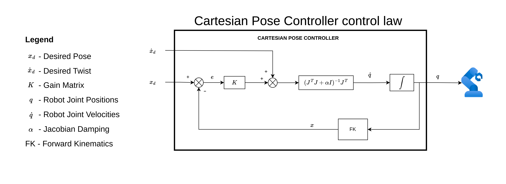

# Cartesian Pose Controller

This package provides a Cartesian pose controller that converts desired end-effector poses and twists in task space to joint position commands for a robotic manipulator.
It is a chainable controller that works with the [`task space reference generator`](../reference_generator/README.md) to obtain references.

## Control Law

The control law is illustrated in the figure below:

Note that the task space references should be expressed in the `task_space_reference_frame` (see [Controller Configuration](#controller-configuration)).
If the desired twist is not provided (and the controller is configured correctly), the controller computes the desired twist from the desired pose.

To guarantee controller stability, users must ensure that the gain matrix `K` is positive definite.
The matrix `K` is constructed as a diagonal matrix from the user-provided gain vector `k_matrix_gains` (see [Controller Configuration](#controller-configuration)). These gains determine the controller's convergence speed.

## Controller Configuration

Control parameters for the cartesian pose controller are defined in the file [cartesian_pose_controller_parameters.yaml](src/cartesian_pose_controller_parameters.yaml).
Please refer to [`cartesian_pose_controller_parameters.md`](./doc/cartesian_pose_controller_parameters.md) for the documentation.

## Demo

To test this controller in simulation, please refer to the documentation of [`ur10_cartesian_controller_demo`](../ur10_cartesian_controller_demo/README.md).
