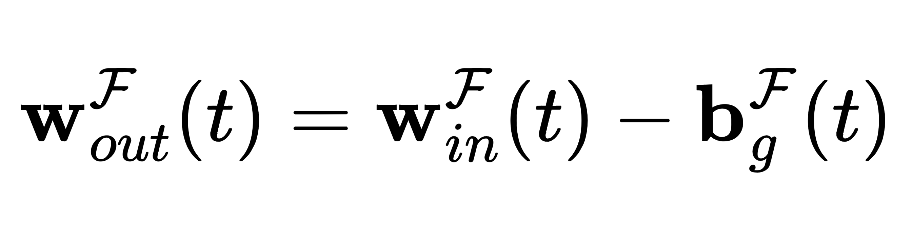
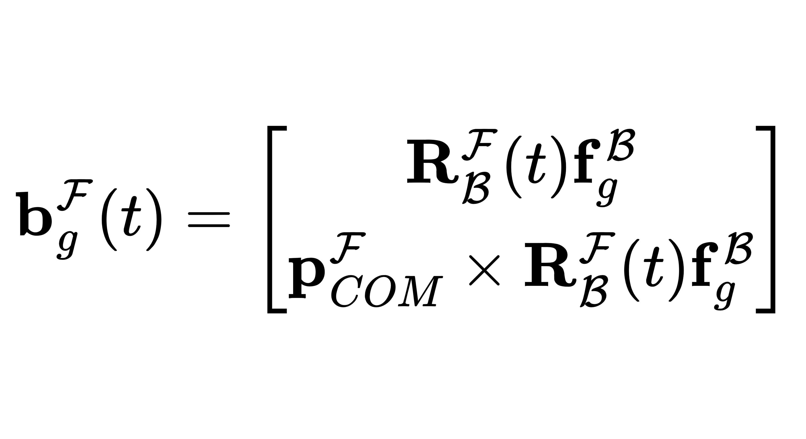
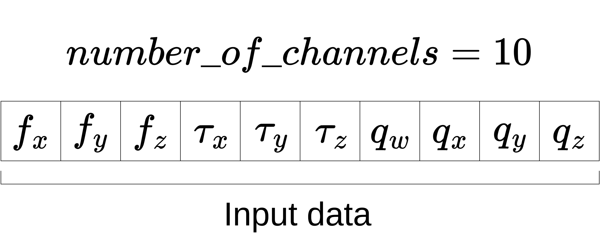

# gravity_compensation_filter

In this package, the `GravityCompensationFilter` class is provided, extending the `filters::MultiChannelFilterBase` base class of the [filters](https://github.com/ros/filters/tree/ros2) ROS2 package.

The `GravityCompensationFilter` compensates gravitational wrenches acting on force/torque sensor measurements.

**Note**: This filter does not compensate for inertial forces caused by acceleration and coriolis effects, but only for the gravitational forces acting on the force/torque sensor measurements based on the knowledge of the payload's inertial parameters (mass and center of mass).

## Definition

A gravity compensation filter is formally defined as:



where:

* _t_ is the most recent measurement index;
* _w_out^F(t)_ is the gravity compensated wrench in the force/torque sensor frame _F_ at time _t_;
* _w_in^F(t)_ is the input raw wrench in _F_ at time _t_;
* _b_g^F(t)_ is the gravity bias in _F_ at time _t_.

The gravity bias _b_g^F(t)_ is computed as:



where:

* R_B^F(t)_ is the rotation matrix from the force/torque sensor frame _F_ to the base frame _B_ at time _t_;
* _f_g^B_ is the gravity force in the base frame _B_;
* _p_COM^F(t)_ is the position of the center of mass (COM) of the robot in the force/torque sensor frame _F_ at time _t_.

## How to configure

In the case of the `GravityCompensationFilter` class, the filter-specific parameters to configure are:

* `robot_description`: the robot description necessary to compute the payload mass and COM;
* `ft_sensing_frame_name`: the name of the sensing frame with respect to which the force/torque sensor measurements are provided;
* `gravity`: the gravity vector in the base frame _B_.

Furthermore, as explained also in the [container documentation](../README.md#how-to-configure), the `configure()` method of the base class also expects the number of channels.
In the case of the `GravityCompensationFilter` class, such number must be set to 10: 6 for the wrench measurement and 4 for the quaternion representing the orientation of the base frame with respect to the force/torque sensor frame.

## How to use

After configured, the `update()` method receives a raw wrench and the current orientation and computes the gravity compensated wrench.

The filter assumes that the input data are given in the order: 1) wrench; 2) quaternion, as shown in the following figure.



## How to build

For importing and using this package, it is necessary to build it first:

```bash
colcon build --packages-up-to gravity_compensation_filter
source install/setup.bash
```

## Gravity compensation integration test

This package provides an [integration test](./test/test_gravity_compensation_variable_orientation.cpp) that validates gravity compensation with a variable robot orientation using a filter chain composed of the [`GravityCompensationFilter`](include/gravity_compensation_filter/gravity_compensation_filter.hpp) and [`UnbiasingFilter`](../unbiasing_filter/include/unbiasing_filter/unbiasing_filter.hpp) classes.

The variable orientation trajectory is provided in the [`bagfiles`](./test/bagfiles/) folder, while the filter chain configuration is provided in the [`gravity_compensation_variable_orientation_config.yaml`](./test/config/gravity_compensation_variable_orientation_config.yaml) file.

### How to test

If you want to perform the test contained in this package after the build, you must start an Ignition simulation with the following command:

```bash
ros2 launch gravity_compensation_filter demo_gazebo_ros2_control.launch.py
```

Then, you can perform test with the following command:

```bash
colcon test --packages-select gravity_compensation_filter
```

If the terminal does not show the test details, you should run the following command:

```bash
colcon test-result --all --verbose
```

### Optional analysis

If you wish to see the INFO messages printed on console during the test, run the following:

```bash
colcon test --packages-select gravity_compensation_filter --event-handlers console_cohesion+
```

The expected output should contain the following line:

```text
100% tests passed, 0 tests failed out of 1
```
