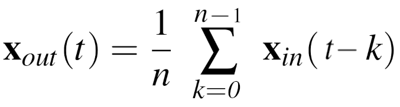
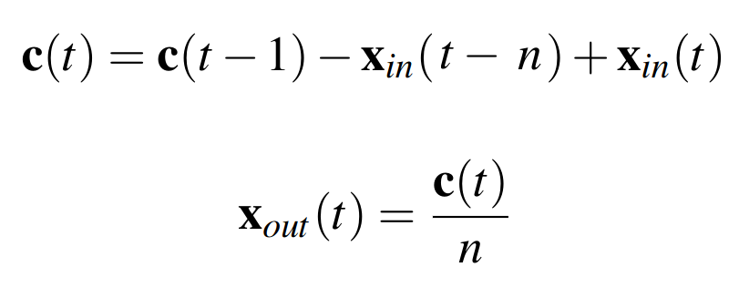

# moving_average_filter

In this package, the `MovingAverageFilter` class is provided, which extends the `filters::FilterBase` base class of the [filters](http://wiki.ros.org/filters) ROS2 package.

## Definition

A moving average filter averages samples of a recent past over a fixed-size window. It is formally defined as:



where:

- *t* is most recent sample index;
- *n* is the number of samples collected, or the size of the window if filled;
- *x_out(t)* is the filtered output at time *t*;
- *x_in(t)* is a single sample from the window at time *t*.

The definition is previously used in the `filters::MeanFilter` [implementation](https://github.com/ros/filters/blob/noetic-devel/include/filters/mean.hpp). The time complexity is *O(n)*.

The present package, instead, keeps and updates the current cumulative sum at each new sample, performing the averaging operation in *O(1)*. The implementation is as follows:



where:

- *c(t)* is the cumulative sum at present time index *t*.

## How to configure

In the case of the `MovingAverageFilter`, the filter-specific parameters needed are:

- `number_of_observations`: the size *n* of the moving window;

## How to build

For importing and using this package, you need to build it first:

```bash
colcon build --packages-up-to moving_average_filter
```

Do not forget to source your workspace after built:

```bash
source install/setup.bash
```

## How to test

If you want to perform the tests contained in this package after the build, you must launch the following command:

```bash
colcon test --packages-select moving_average_filter
```

If the terminal does not show the test details, you should run the following command:

```bash
colcon test-result --all --verbose
```

## Optional analysis

If you wish to see the INFO messages printed on console during the test, run the following:

```bash
colcon test --packages-select moving_average_filter --event-handlers console_cohesion+
```

The expected output should contain the following line:

```text
100% tests passed, 0 tests failed out of 1
```
