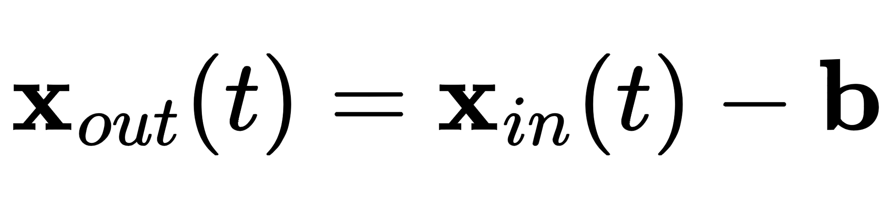
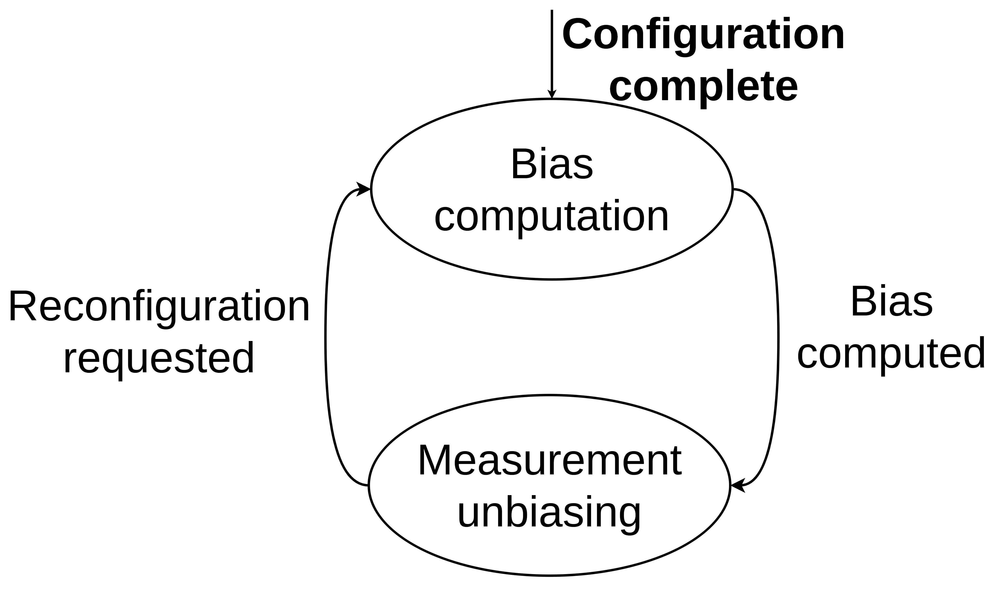
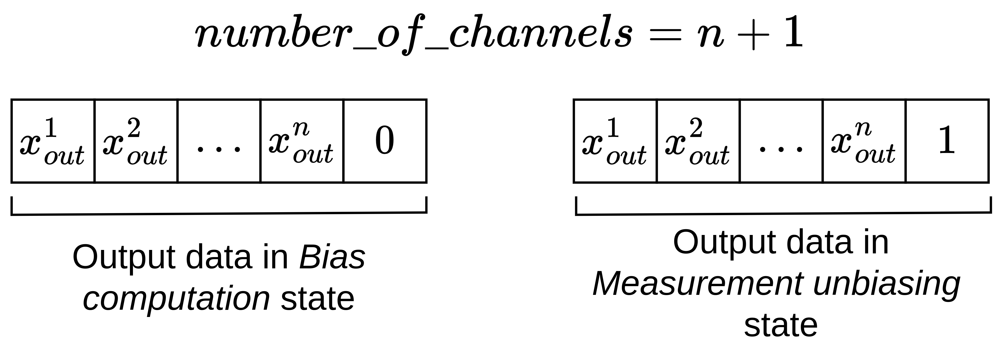

# unbiasing_filter

In this package, the `UnbiasingFilter` class is provided, extending the `filters::MultiChannelFilterBase` base class of the [filters](https://github.com/ros/filters/tree/ros2) ROS2 package.

The `UnbiasingFilter` utilizes an instance of the `MultiChannelMovingAverageFilter` to compute measurement bias and provide unbiased measurements.
For more details on how the `MultiChannelMovingAverageFilter` works, please refer to its [documentation](../multi_channel_moving_average_filter/README.md).

## Definition

An unbiasing filter removes bias from raw measurements. It is formally defined as:



where:

* _t_ is the most recent measurement index;
* _x_out(t)_ is the unbiased measurement at time _t_;
* _x_in(t)_ is the input raw measurement at time _t_;
* _b_ is the measurement bias.

The measurement bias _b_ is computed during an initialization phase (see the following section for further details), as the average value of stable raw measurements provided as output by the `MultiChannelMovingAverageFilter`.
Stable measurements are defined as measurements that are non-zero and equal to the previous ones within a certain tolerance.

## Some introductory information to unbiasing filter

In order to use the unbiasing filter correctly, it is important to know some implementation details.
The filter has been designed to have two internal states.



The states are:

* _Bias computation_: the filter simply computes the measurement bias, providing inaccurate unbiased measurements as an output:
* _Measurement unbiasing_: the filter removes the bias from the raw measurements.

The transitions are:

* _Configuration complete_: occurs when the filter is successfully configured;
* _Bias computed_: occurs when the filter has received enough stable measurements and has computed the bias;
* _Reconfiguration requested_: occurs when a reconfiguration request is received, i.e. the `configure()` method is called.

## How to configure

In the case of the `UnbiasingFilter` class, the filter-specific parameters to configure are:

* `number_of_stable_samples_for_bias`: the number of the stable measurements necessary to compute the bias;
* `tolerance`: the tolerance between two consecutive measurements

This parameter must be a node-specific parameter, and you need to pass the node's parameter interface to the configure method of the MultiChannelFilterBaseClass to properly configure the filter.

Examples of configuration can be found in the [test/test_unbiasing_filter.cpp](./test/test_unbiasing_filter.cpp) file.

Furthermore, as also explained in the [container documentation](../README.md#how-to-configure), the `configure()` method of the base class also expects the number of channels.
In the case of the `UnbiasingFilter` class, such number must be set to the number of channels of the measurements to be filtered plus 1, both in isolated use and within a filter chain.
For further details about this additional channel, refer to the following section.

## How to use

After configured, the `update()` method receives a raw measurement and retrieves the unbiased one.

As long as the filter is in the _Bias computation_ state, the bias estimate may be inaccurate, as the filter still requires the minimum number of stable measurements.
The filter's persistence in such state is indicated by the presence of a zero in the last channel of the output vector.

Once the filter obtains a valid estimate of the bias, i.e. it transitions to the _Measurement unbiasing_ state, it sets the last channel of the output vector to 1.



## Tests

This package provides a set of [tests](./test/test_unbiasing_filter.cpp) for the [`UnbiasingFilter`](./include/unbiasing_filter/unbiasing_filter.hpp) class and an [integration test](./test/test_gravity_compensation_fixed_orientation.cpp) that validates gravity compensation with a fixed robot orientation using the same class.

### How to test

If you want to perform the tests contained in this package after the build, you must start an Ignition simulation with the following command:

```bash
ros2 launch unbiasing_filter demo_gazebo_ros2_control.launch.py
```

Then, you can perform tests with the following command:

```bash
colcon test --packages-select unbiasing_filter
```

For more details, run:

```bash
colcon test-result --all --verbose
```

**Note:** The Ignition simulation is required only for the integration test, but it must be started before executing the tests, as they are run sequentially using the `colcon test` command.

### Optional analysis

If you wish to see the INFO messages printed on console during the test, run:

```bash
colcon test --packages-select unbiasing_filter --event-handlers console_cohesion+
```

The expected output should contain the following line:

```text
100% tests passed, 0 tests failed out of 2
```
