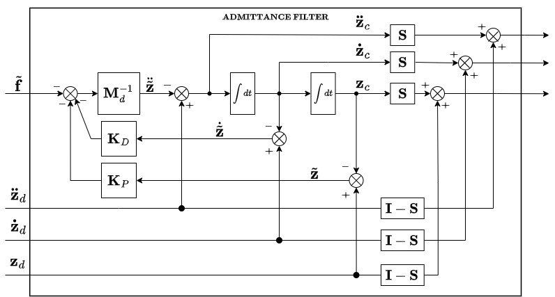

# admittance_filter

This package contains the implementation of a class representing an admittance filter, namely `AdmittanceFilter` class, which extends the [`interaction_filters::InteractionFilterBase`](../interaction_filter_base/include/interaction_filter_base/interaction_filter_base.hpp) base class.

The purpose of this filter is to compute the admittance control logic for a 0-1-2 order filter. Starting from the desired pose, desired twist, desired acceleration and the error wrench, it computes the commanded pose, commanded twist and commanded acceleration.

The admittance filter scheme is shown in the following figure:



where _S_ is a selection diagonal matrix composed of 1.0 and 0.0, used to select the axes on which admittance law is applied.

## Admittance filter configuration

Parameters for the `AdmittanceFilter` class are defined in the `admittance_filter.yaml` configuration file, and have the following structure:

* `mass`: specifies the mass values for x, y, z, rx, ry, and rz used in the admittance law;
* `damping_ratio`: specifies the damping ratio values for x, y, z, rx, ry, and rz used in the admittance law. The damping ratio is defined as: damping / (2 sqrt( mass stiffness ));
* `stiffness`: specifies the stiffness values for x, y, z, rx, ry, and rz used in the admittance law;
* `order`: specifies the order of the admittance filter;
* `compliant_axis`: represent the _S_ matrix and specifies the axes to be used in the admittance filter.

## Unit tests

The package is provided with a ROS2 test case to test the `AdmittanceFilter` class, in particular the `update()` method.

The ground truth is written into different bagfiles into the [bagfiles](./test/bagfiles/) folder:

* step_response_order_x.bag
* ramp_response_order_x.bag

where x represents the order of the admittance filter to test (i.e. 0, 1 or 2).

### Structure of ground truth bag files

The ground truth has been generated by using a MATLAB script and Simulink in order to generate data from the transfer function of the admittance filter.

In each ground truth bag file, the input used to compute the expected output is stored into the `/admittance_filter_input` topic, while the expected output is stored into the `/admittance_filter_output/pose`, `/admittance_filter_output/twist` and `/admittance_filter_output/acceleration` topics.

The input is contained into a sequence of `std_msgs/Float64MultiArray` messages, each one containing an array of 7 elements. The first 6 elements represent the difference between the desired and the measured wrenches, in terms of linear forces and momenta. In the last element, the timestamp of the reference is stored.
The output is contained into three sequences of `std_msgs/Float64MultiArray` messages, containing the expected pose, twist and acceleration, respectively, based on that particular input.

### How to test

If you want to perform the tests contained in this package after the build,run the following command:

```bash
colcon test --packages-select admittance_filter
```

For more details, run:

```bash
colcon test-result --all --verbose
```

### Optional analysis

If you wish to see the INFO messages printed on console during the test, run:

```bash
colcon test --packages-select admittance_filter --event-handlers console_cohesion+
```

The expected output should contain the following line:

```text
100% tests passed, 0 tests failed out of 2
```
