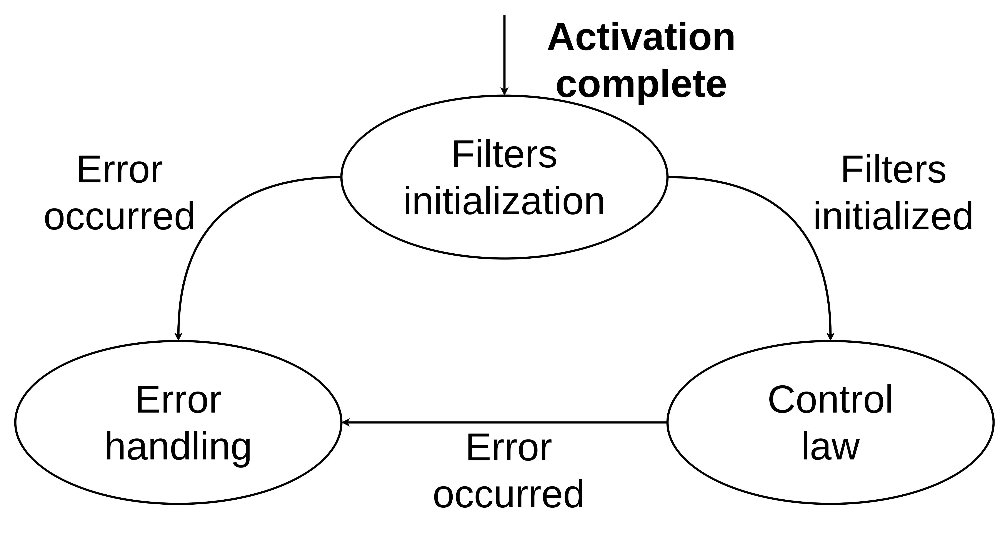
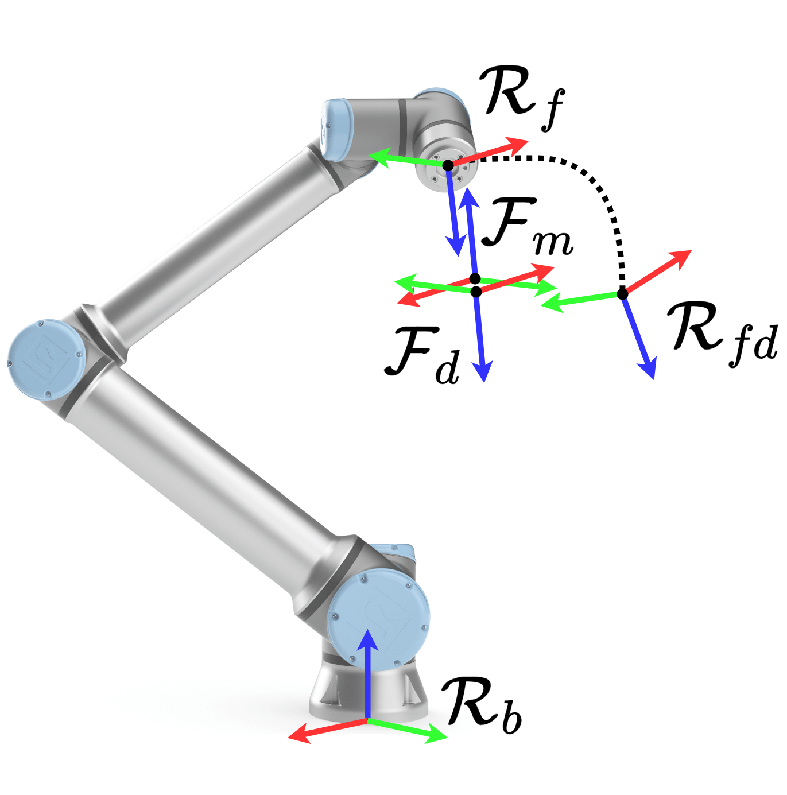

# motion_based_interaction_controller

This package provides a [superclass](./include/motion_based_interaction_controller/motion_based_interaction_controller.hpp) for a generic motion-based interaction controller.

This class extends the `controller_interface::ChainableControllerInterface` interface and it is designed to be used as a base class for specific implementations of motion-based interaction controllers.
Indeed, it decouples the internal state, force sensor, and interaction filter management, from the computation of the specific control law.

## Finite State Machine

The controller implements a finite state machine (FSM).
A finite state machine, or FSM, is a computational model based on a hypothetical machine made up of one or more states.
Only a single state can be active at the time, so the machine has to switch between states to perform several actions.
An FSM can be represented by a graph, in which the nodes are the states and the links are the transitions.

The FSM has the following states:

* _Filters initialization_: the controller is active and is waiting for the initialization of the filters chain, responsible for the filtering of the interaction forces (see the [`unbiasing_filter` documentation](../filters/unbiasing_filter/README.md#how-to-use) for futher details about filters initialization). The specific control law is not executed in this state, and the current robot pose is held;
* _Control law_: the controller is active and the control law is executed;
* _Error handling_: the controller is active in an error state and the control law is not executed. The current robot pose is held, waiting for a restart.

The transitions are:

* _Activation complete_: occurs when the controller is activated;
* _Filters initialized_: occurs when the filters chain is initialized and the controller is ready to execute the control law;
* _Error occurred_: occurs when an error arises in the controller.

## Reference frames

The reference frames used by the motion-based interaction controller are reported in the figure below.

The reference frames are defined as follows:

* _R_b_ is the motion reference frame, in which task space motion reference, state and command are given;
* _R_f_ is the flange frame (usually the last frame in a kinematic chain without end-effector);
* _R_fd_ is the desired flange frame, represented by the desired pose;
* _F_m_ is the force/torque sensor frame, with respect to which force/torque measures are given;
* _F_d_ is the force/torque reference frame, with respect to which reference force/torque is given.

## Controller interfaces

The motion-based interaction controller receives task space references, writes task space commands and reads the robot and the force/torque sensor state according to the interfaces specified in the [controller configuration](README.md#controller-configuration).

### Task space reference interfaces

The task space reference interfaces available are:

* `pose`: the controller receives the task space pose references expressed with respect to the `task_space_reference_frame` from the following reference interfaces:

    * `<controller_name>/position.x`
    * `<controller_name>/position.y`
    * `<controller_name>/position.z`
    * `<controller_name>/orientation.x`
    * `<controller_name>/orientation.y`
    * `<controller_name>/orientation.z`
    * `<controller_name>/orientation.w`

* `twist`: (optional) the controller receives the task space twist references expressed with respect to the `task_space_reference_frame` from the following reference interfaces:

    * `<controller_name>/twist.linear.x`
    * `<controller_name>/twist.linear.y`
    * `<controller_name>/twist.linear.z`
    * `<controller_name>/twist.angular.x`
    * `<controller_name>/twist.angular.y`
    * `<controller_name>/twist.angular.z`

* `wrench`: (optional) the controller receives the task space wrench references expressed with respect to the `wrench_reference_frame` from the following reference interfaces:

    * `<controller_name>/force.x`
    * `<controller_name>/force.y`
    * `<controller_name>/force.z`
    * `<controller_name>/torque.x`
    * `<controller_name>/torque.y`
    * `<controller_name>/torque.z`
    * `<controller_name>/torque.w`

If this convention is not desired, the user can specify the custom names using the `reference_interfaces_names_override` parameter in the controller configuration.

### Task space command interfaces

The task space command interfaces available are:

* `pose`: the controller writes the task space pose commands expressed with respect to the `task_space_reference_frame` from the following command interfaces:

    * `<task_space_command_controller>/position.x`
    * `<task_space_command_controller>/position.y`
    * `<task_space_command_controller>/position.z`
    * `<task_space_command_controller>/orientation.x`
    * `<task_space_command_controller>/orientation.y`
    * `<task_space_command_controller>/orientation.z`
    * `<task_space_command_controller>/orientation.w`

* `twist`: (optional) the controller writes the task space twist commands expressed with respect to the `task_space_reference_frame` from the following command interfaces:

    * `<task_space_command_controller>/twist.linear.x`
    * `<task_space_command_controller>/twist.linear.y`
    * `<task_space_command_controller>/twist.linear.z`
    * `<task_space_command_controller>/twist.angular.x`
    * `<task_space_command_controller>/twist.angular.y`
    * `<task_space_command_controller>/twist.angular.z`

where the `task_space_command_controller` parameter represents the name of the task space controller downstream in the chain.
If this convention is not desired, the user can specify the custom names using the `command_interfaces_names_override` parameter in the controller configuration.

### State interfaces

The motion-based interaction controller reads the robot joint positions to compute the forward kinematics from state interfaces in the following format:

  `<robot_name>/joint_i_name/position`

where `robot_name` is the name of the robot and `joint_i_name` is the name of the joint i in the robot URDF model.
If this convention is not desired, the user can specify the custom names using the `state_interfaces_names_override` parameter in the controller configuration.

The controller also reads the force/torque sensor state from the following state interfaces:

* `<force_torque_sensor.name>/force.x`
* `<force_torque_sensor.name>/force.y`
* `<force_torque_sensor.name>/force.z`
* `<force_torque_sensor.name>/torque.x`
* `<force_torque_sensor.name>/torque.y`
* `<force_torque_sensor.name>/torque.z`

where `force_torque_sensor.name` is the name of the force/torque sensor.
If this convention is not desired, the user can specify the custom names using the `ft_sensor_state_interfaces_names_override` parameter in the controller configuration.

## Controller configuration

Control parameters for a motion-based interaction controller are specified in the [`motion_based_interaction_controller_parameters.yaml`](./src/motion_based_interaction_controller_parameters.yaml) configuration file.
Please refer to [`motion_based_interaction_controller_parameters.md`](./doc/motion_based_interaction_controller_parameters.md) for the documentation.
