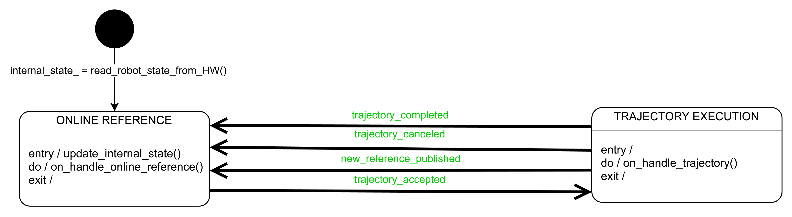

# reference_generator

This package provides two kinds of reference generators in ROS 2:

- **Joint Space Reference Generator**: Handles joint space references received via either a topic or an action server.
    It can command both joint space and task space references.
- **Task Space Reference Generator**: Handles task space references received via either a topic or an action server.
    It exclusively commands task space references.

Both reference generators extend the `ros2_controller` interface `controller_interface::ControllerInterface`.
When these controllers are used with other controllers via chaining, they allow the decoupling of reference management from control law computation.

Note that the term "reference" refers to the input of the controller, which can be received either via a topic or an action server.
In contrast, the term "command" refers to the output of the controller, i.e. the reference that is forwarded to another controller or directly to the robot hardware.
The received reference may undergo further processing (e.g., interpolation) before being written to the command interfaces.

In the ROS 2 framework, both reference interfaces and command interfaces are instances of the `CommandInterface` class.
Although they are conceptually different, they share the same structure.

## Online and Offline Reference Handling

Reference generators can handle both the forwarding of online references and the execution of offline trajectories.
The logic with which references are handled is subsumed by the following Finite State Machine (FSM):

The main states of the controller are:

- **ONLINE_REFERENCE**: In this state, the reference generator writes the exact reference received via topic to the command interfaces.
    If the reference generator has just started and has not yet received any reference via topic, it reads the current state of the robot and writes it to the command interfaces.

- **TRAJECTORY_EXECUTION**: In this state, the reference generator has received and accepted a new trajectory from an external action client.
    Based on the controller frequency and the trajectory point timestamps, the reference generator performs linear interpolation to compute the reference values to write to the command interfaces.
    If the trajectory execution is completed, aborted, or a new reference is received via a topic, the reference generator transitions back to the **ONLINE_REFERENCE** state.
    Additionally, if a new trajectory is received and accepted, the reference generator will abort the current trajectory execution and begin the new one.

## Writing References to Command Interfaces

The reference generator writes the references to the command interfaces in the following way according to the task space and joint space command interfaces specified in the controller configuration.
The **Joint Space Reference Generator** can write references to joint space command interfaces, and it can also calculate the forward kinematics to write references to task space command interfaces.
On the other hand, the **Task Space Reference Generator** can only write to task space command interfaces.

The available joint space command interfaces are:

- `position`: the reference generator writes for each joint the position references to the command interface `<controller_name>/<joint_name>/position`, following the order of the joints specified in the controller configuration.
- `velocity`: the reference generator writes for each joint the velocity references to the command interface `<controller_name>/<joint_name>/velocity`, following the order of the joints specified in the controller configuration.
- `acceleration`: the reference generator writes for each joint the acceleration references to the command interface `<controller_name>/<joint_name>/acceleration`, following the order of the joints specified in the controller configuration.
- `effort`: the reference generator writes for each joint the effort references to the command interface `<controller_name>/<joint_name>/effort`, following the order of the joints specified in the controller configuration.
- `wrench`: the reference generator writes the wrench references expressed with respect to the `wrench_reference_frame` to the following command interfaces:

    - `<controller_name>/force.x`
    - `<controller_name>/force.y`
    - `<controller_name>/force.z`
    - `<controller_name>/torque.x`
    - `<controller_name>/torque.y`
    - `<controller_name>/torque.z`

The task space command interfaces available are:

- `pose`: the reference generator writes the task space pose references expressed with respect to the `task_space_reference_frame` to the following command interfaces:

    - `<controller_name>/position.x`
    - `<controller_name>/position.y`
    - `<controller_name>/position.z`
    - `<controller_name>/orientation.x`
    - `<controller_name>/orientation.y`
    - `<controller_name>/orientation.z`
    - `<controller_name>/orientation.w`

- `twist`: the reference generator writes the task space twist references expressed with respect to the `task_space_reference_frame` to the following command interfaces:

    - `<controller_name>/linear_velocity.x`
    - `<controller_name>/linear_velocity.y`
    - `<controller_name>/linear_velocity.z`
    - `<controller_name>/angular_velocity.x`
    - `<controller_name>/angular_velocity.y`
    - `<controller_name>/angular_velocity.z`

- `acceleration`: the reference generator writes the task space acceleration references expressed with respect to the `task_space_reference_frame` to the following command interfaces:

    - `<controller_name>/linear_acceleration.x`
    - `<controller_name>/linear_acceleration.y`
    - `<controller_name>/linear_acceleration.z`
    - `<controller_name>/angular_acceleration.x`
    - `<controller_name>/angular_acceleration.y`
    - `<controller_name>/angular_acceleration.z`

- `wrench`: the reference generator writes the wrench references expressed with respect to the `wrench_reference_frame` to the following command interfaces:

    - `<controller_name>/force.x`
    - `<controller_name>/force.y`
    - `<controller_name>/force.z`
    - `<controller_name>/torque.x`
    - `<controller_name>/torque.y`
    - `<controller_name>/torque.z`

- `wrench_derivative`: the reference generator writes the wrench derivative references expressed with respect to the `wrench_reference_frame` to the following command interfaces:

    - `<controller_name>/force_derivative.x`
    - `<controller_name>/force_derivative.y`
    - `<controller_name>/force_derivative.z`
    - `<controller_name>/torque_derivative.x`
    - `<controller_name>/torque_derivative.y`
    - `<controller_name>/torque_derivative.z`

For each of the command interfaces, the user can optionally specify custom names using the `command_interfaces_names_override` parameter in the controller configuration.

Note that the reference generator writes the references to the command interfaces in the order specified above, regardless of the order of the task space and joint space command interfaces in the controller configuration.

## Controller Configuration

### Joint space reference generator

Control parameters for the task reference generator are defined in the file [task_space_reference_generator_parameters.yaml](src/task_space_reference_generator_parameters.yaml).
Please refer to [`reference_generator_parameters.md`](./doc/reference_generator_parameters.md) and [`joint_space_reference_generator_parameters.md`](./doc/joint_space_reference_generator_parameters.md) for the documentation.

### Task space reference generator

Control parameters for the joint reference generator are defined in the file [joint_space_reference_generator_parameters.yaml](src/joint_space_reference_generator_parameters.yaml).
Please refer to [`reference_generator_parameters.md`](./doc/reference_generator_parameters.md) and [`task_space_reference_generator_parameters.md`](./doc/task_space_reference_generator_parameters.md) for the documentation.

IMPORTANT: The kinematics interface for ROS2 Humble does not require the `kinematics.base` parameter, as the base link is always assumed to be the root link of the robot (e.g. the frame `world`).
However, if this code is ported to a later ROS2 distribution, this parameter may become necessary.

## Demo

To test this controller in simulation please refer to the documentation of [`acg_resources_ur10_moveit_config`](../acg_resources_ur10_moveit_config/README.md#simulation-with-reference-generators).

## Requirements

To use this package, the user must have a kinematics plugin that implements the kinematics::KinematicsInterface interface installed on the system, as this package does not depend on any specific kinematics plugin.

## Known Issues and Limitations

- When **Joint Space Reference Generator** is activated, it sets the joint positions to the current state of the robot.
    Joint velocities and accelerations are set to zero, while joint efforts are set to the current state of the robot if available, or to NaN otherwise.
    The task space reference pose is set to the current tip pose, while the twist, acceleration, and wrench references are set to zero.

- When the **Task Space Reference Generator** is activated, it sets the task space pose to the current tip pose, while the twist, acceleration, and wrench references are set to zero.

- The **Joint Space Reference Generator** calculates task space references using the forward kinematics plugin specified in the configuration file, starting from joint positions and/or velocities.
    Consequently, the reference generator is not able to compute acceleration, wrench, and wrench derivative values for the task space command interfaces, even if they are specified in the controller configuration.
    In such cases, these task space reference values are set to NaN.
    Another consequence of this limitation is that if the `pose` and/or `twist` command interfaces are specified in the controller configuration, the reference generator will require the joint `position` and/or `velocity` in the message passed via topic or action server.

    - This limitation also affects the **Task Space Reference Generator** when computing feedback during trajectory execution.
        Feedback is calculated using forward kinematics from the current state of the robot, so only the pose and twist interfaces (if available) are considered; acceleration, wrench, and wrench derivative interfaces are set to NaN.

- For the **Joint Space Reference Generator**, if the `state_interfaces` do not include at least the same interfaces as the `joint_space_command_interfaces`, the controller will treat missing interfaces as having NaN values during trajectory execution.
    This can lead to inconsistencies with the actual robot state, as proper feedback computation requires information from the `state_interfaces`.
    Additionally, this controller is unable to read wrench values from the robot, so these values are always set to NaN.

- Both reference generators use linear interpolation to compute references during trajectory execution.
    This design decision applies linear interpolation uniformly to all trajectory point interfaces.
    However, this approach may result in incongruent poses, twists, and acceleration references unless the reference is specifically designed to keep the robot still.

- Both the trajectory messages (`JointTrajectory.msg` and `TaskSpaceTrajectory.msg`) for the **Joint Space Reference Generator** and the **Task Space Reference Generator** contain a `header` field, which includes the `frame_id` field.
    However, this field is not used by the reference generators, as the controller relies on the reference frame (wrench and/or motion) contained in the point message (`JointWrenchPoint.msg` or `TaskSpacePoint.msg`).
    If these fields are empty, the reference generators will default to the reference frame specified in the configuration file (`wrench_reference_frame` and/or `task_space_reference_frame`).
