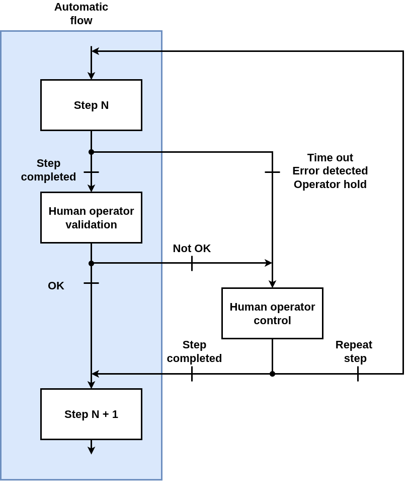
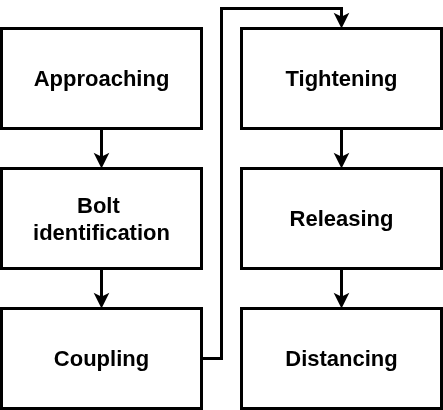

# screwdriving_supervisory_controller

This package implements a supervisory controller for screwing operations.
It provides a framework for managing screwdriving tasks, including error handling and manual control modes.

## Overview

The supervisory controller is designed as a finite state machine (FSM) that transitions between different steps based on the robot's actions, the human operator's inputs, and the environment's conditions.
It integrates with ROS 2 to facilitate communication and control of the robot.
The FSM is modeled according to the following model:

and implements the step shown in the following figure:

## Demos

Refer to the [`ur5e_app_screwdriving_supervisory_control` package](../ur5e_app_screwdriving_supervisory_control/README.md) for demo of the supervisory controller in action.
